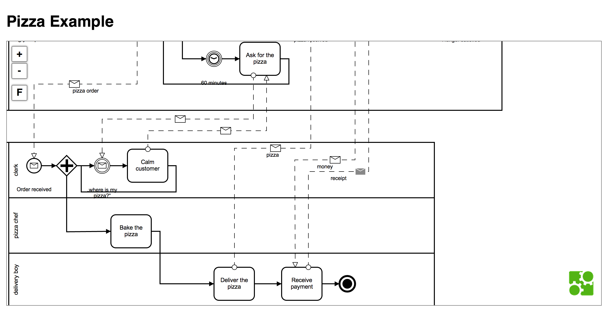

# bpmn.io zoom control example

Example of how to build custom controls for a [bpmn.io](http://bpmn.io/) viewer.

# Usage

    git clone <this repo> && cd bpmnio-zoom-control-example
    npm install
    grunt build && grunt auto-build